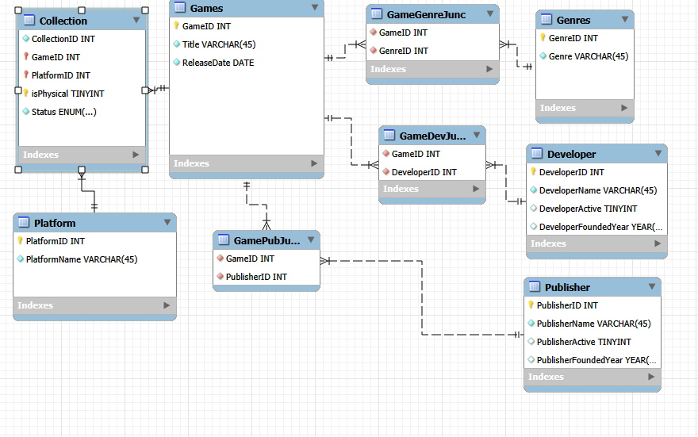

## Game Collection Database

> This is a game collection database created for my final project for IT 125 Using SQL & SQL Server.

> I have a large collection of video games on various platforms and in different regions. This database would serve as a tool for organizing my collection, to avoid duplicate purhcases, and to help deciding what to play.

#### Tools Used
* MySQL Workbench
* Visual Studio Code
* GitHub

#### Instructions

> Coming Soon

#### Updates

> August 19th, 2025

> Rewrote the GitHub README.md and organized the files better for the database. Will be working on the SQL script next.

---

> August 9th, 2025

> The publisher/dev thing did come back to bite me. Couldn't pass normalization form. Added a publisher and devloper table and corresponding junction tables linked to the games table. This should now pass 1NF-3NF.

---

> This is a test version of my game collection database project. I decided to remove ESRB ratings, because I'm old and decrepit and they don't matter to me. I also removed developers and publishers from being their own table, which may come to bite me later on, as a game can have many different devs and pubs. I removed the status table, as it seemed frivolous. I included it in the collection table instead. I tried to implement a variety of games that I own that can help me with testing. Some games I own in multiple regions or platforms. Also, a few games, I could not find an actual release date for, which will prove interesting. I could not get my ER Diagram to accept a boolean data type, and had to settle for TINYINT, 0 being false. Maybe someone can suggest a fix? If not, I can just code it out in the database creation.